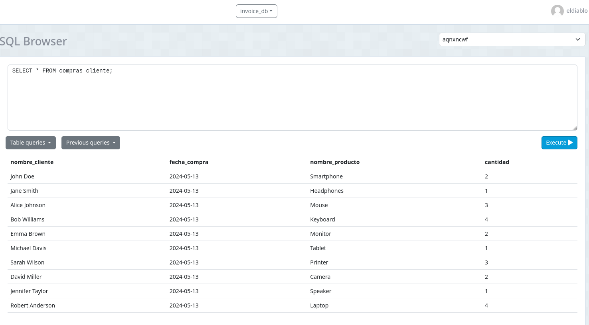
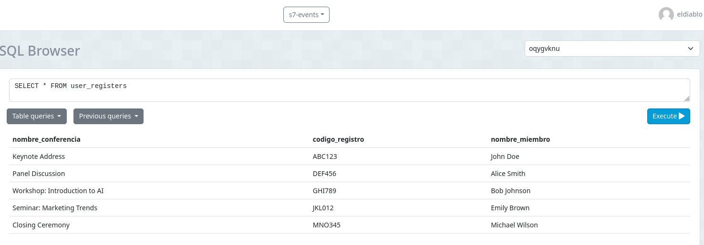

# 3.2 Views

>
>   #### Views o Vistas en PostgreSQL
>
>   Una vista en PostgreSQL es una tabla virtual que se crea a partir de una consulta SQL. Las vistas no almacenan datos por sí mismas; en su lugar, muestran los datos de una o más tablas base según la consulta definida. 
>   Las vistas se utilizan para simplificar consultas complejas, proporcionar seguridad al restringir el acceso a datos sensibles.

##  Indicaciones Tarea Autónoma:
### 1. Crear una vista que muestre la lista de productos comprados por los clientes con los siguientes parámetros:

- Base de datos: **invoice**
- Columnas: 
    - nombre_cliente
    - fecha_compra
    - nombre_producto
    - cantidad


#### Crear view

```sql
CREATE VIEW compras_cliente AS
SELECT 
    c.fullname AS nombre_cliente, 
    i.create_at AS fecha_compra, 
    p.description AS nombre_producto, 
    d.quantity AS cantidad
FROM client c
JOIN invoice i ON c.id = i.client_id
JOIN detail d ON i.id = d.invoice_id
JOIN product p ON d.product_id = p.id
;
```
#### Llamar al view creado


### 2. Crear una vista donde se muestre la lista de miembros registrados a las conferencias con los siguientes parámetros:
- Base de datos: **event**
- Columnas:
    - nombre_conferencia
    - codigo_registro
    - nombre_miembro

tablas utilizadas:
- conference
- member
- event
- register

#### Crear view

```sql
CREATE VIEW user_registers AS
SELECT
    c.title AS nombre_conferencia,
    r.code AS codigo_registro,
    m.fullname AS nombre_miembro
FROM conference c
JOIN register r ON c.id = r.conference_id
JOIN member m ON r.member_id = m.id
;
```

#### Llamar al view creado

