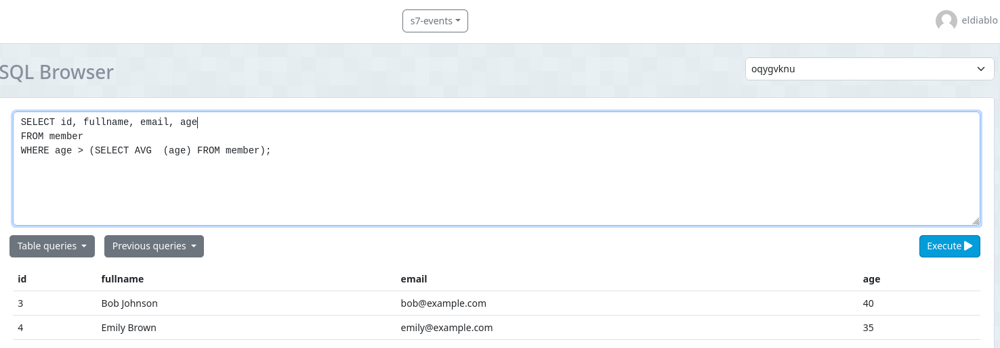
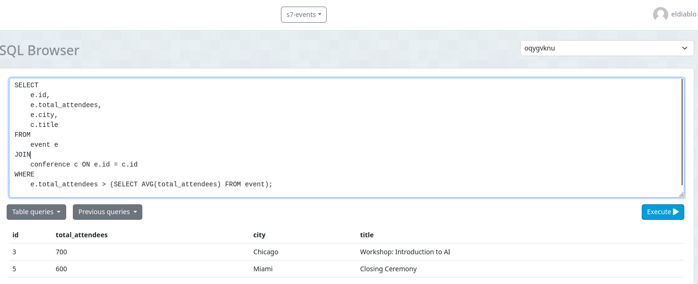

# Subconsultas events 
Este trabajo en clase es la continuación de: **s7-events**

### 1. Obtener los miembros cuya edad es mayor que el promedio de las edades de todos los miembros
```sql
SELECT 
    id, 
    fullname, 
    email, 
    age
FROM member 
WHERE age > (SELECT AVG  (age) FROM member);
```


 
### 2. Obtener los eventos cuyo numero total de asistentes es mayor que el promedio
```sql
SELECT 
    e.id,
    e.total_attendees,
    e.city,
    c.title
FROM
    event e
JOIN
    conference c ON e.id = c.id
WHERE
    e.total_attendees > (SELECT AVG(total_attendees) FROM event);

```
