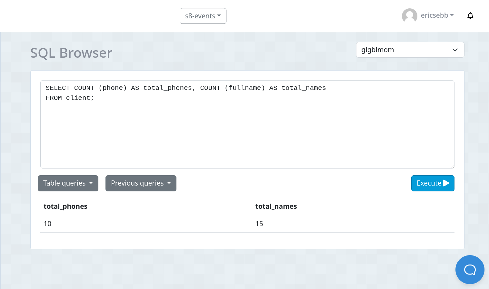
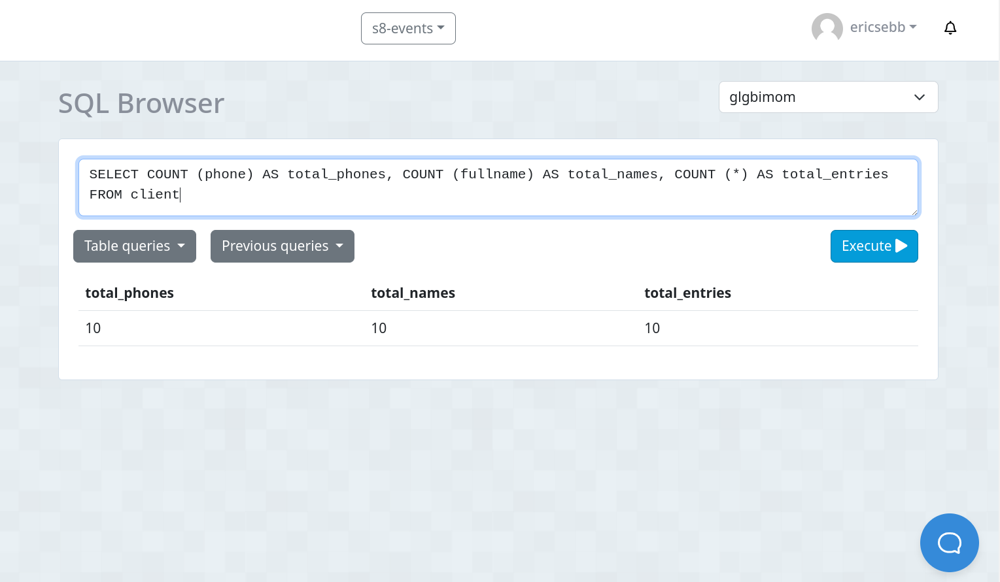
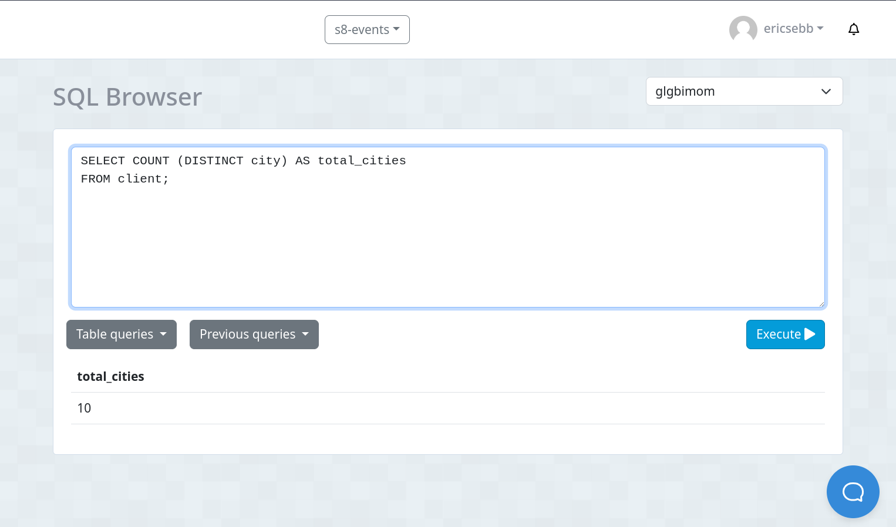

# TC 8 GBD
## 1. Crear tabla `client`

```
CREATE TABLE IF NOT EXISTS client (
id SERIAL,
nui VARCHAR(10) NOT NULL,
fullname VARCHAR(100) NOT NULL,

-- el phone se crea utilizando varchar 15 debido al formato utilizado, ejemplo: +593987654321
phone VARCHAR(15),
type_of_client VARCHAR(50) DEFAULT 'BASIC',
city VARCHAR(50),
credit_limit DECIMAL (7,2)
);
```

## 2. Crear 10 entradas con todos los campos completos

```
INSERT INTO client (nui, fullname, phone, type_of_client, city, credit_limit) 
VALUES 
    ('0000000001', 'Andrés Rodríguez', '+593987654331', 'BASIC', 'Quito', 1200.00),
    ('0000000002', 'Marta López', '+593987654332', 'PREMIUM', 'Guayaquil', 3000.00),
    ('0000000003', 'Ricardo Martínez', '+593987654333', 'BASIC', 'Cuenca', 1700.00),
    ('0000000004', 'Elena García', '+593987654334', 'BASIC', 'Manta', 2200.00),
    ('0000000005', 'Alejandro González', '+593987654335', 'PREMIUM', 'Ambato', 3500.00),
    ('0000000006', 'Laura Torres', '+593987654336', 'BASIC', 'Loja', 1900.00),
    ('0000000007', 'Pablo Sánchez', '+593987654337', 'BASIC', 'Portoviejo', 2400.00),
    ('0000000008', 'Sara Ramírez', '+593987654338', 'PREMIUM', 'Ibarra', 4000.00),
    ('0000000009', 'Roberto Pérez', '+593987654339', 'BASIC', 'Riobamba', 2000.00),
    ('0000000010', 'Ana Gómez', '+593987654340', 'BASIC', 'Esmeraldas', 2300.00);
```

## 3. Crear 5 entradas **sin completar el campo** `phone`

```
INSERT INTO client (nui, fullname, type_of_client, city, credit_limit) 
VALUES 
    ('0000000011', 'Gabriel García', 'PREMIUM', 'Quito', 3200.00),
    ('0000000012', 'Carmen Rodríguez', 'BASIC', 'Guayaquil', 1800.00),
    ('0000000013', 'Diego Martínez', 'BASIC', 'Cuenca', 1500.00),
    ('0000000014', 'Eva López', 'PREMIUM', 'Manta', 2800.00),
    ('0000000015', 'Manuel González', 'BASIC', 'Ambato', 2000.00);
```

## 4. Utilizar la sentencia `COUNT (fullname)`


## 5. Utilizar la sentencia `COUNT (phone)`


## 6. Utilizar la sentencia `COUNT (phone), COUNT (fullname)`



## 7. Utilizar la sentencia `COUNT (phone), COUNT (fullname), COUNT (*)`



## 8. Utilizar la sentencia `COUNT (DISTINCT city)`


